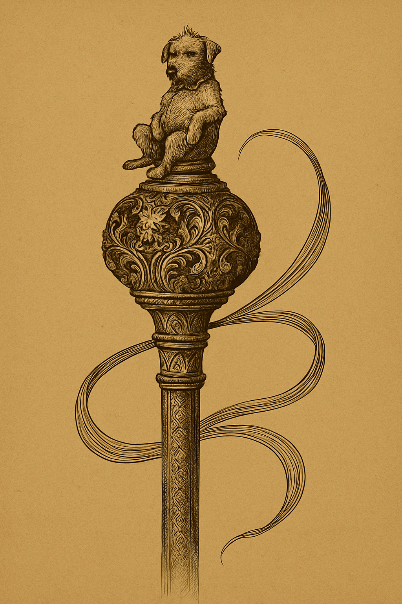

# 👑 Don Fiapo ($FIAPO)
> *The King Has Arrived. The Zoo is Closed.*



## 📜 The Legend
While the crypto world was busy playing with dogs, frogs, and hats, a true monarch was forging his kingdom in the shadows. **Don Fiapo** is not here to fetch a ball or look cute in a meme. He is here to rule.

Enough with the inflationary puppies and utility-less amphibians. Don Fiapo brings **Real Utility**, **Complex Game Theory**, and a **Rust-based Architecture** that would make your average solidity dev cry.

---

## 💎 Why $FIAPO? (or: Why your other bags are dust)

Most memecoins have a roadmap that consists of "Vibe" and "HODL". We have a **state-of-the-art decentralized application**.

### 🛠️ Technical Superiority
- **Lunes Layer 1 Blockchain**: Running on Ink! Smart Contracts (Rust). Fast, secure, and not congested by JPEGs of rocks.
- **Oracle-Verified Payments**: Hybrid architecture bridging Solana mining fees with Lunes execution.
- **On-Chain Governance**: A true DAO where stakers decide the future, not just the devs.

### 🎮 Gamified Economy
1.  **Mining System**: Don't just buy tokens; **mine them** using NFT Pickaxes.
2.  **NFT Evolution**: Combine two NFTs to burn them and forge a higher-tier rarity. Deflationary art.
3.  **Dynamic Staking**: Real APY yields based on protocol revenue, verified on-chain.
4.  **Affiliate Empire**: Build your own court by referring subjects and earning royalties.

---

## 🏰 The Ecosystem

| Feature | Description | The "Others" |
|:---|:---|:---|
| **Mining** | Daily claims based on NFT Tier | No utility |
| **Evolution** | Burn 2x NFTs -> Get 1x Higher Tier | "Right Click Save" |
| **Governance** | Propose & Vote on-chain | "Trust me bro" |
| **Tech Stack** | Rust, Next.js 14, Railway, Docker | A Telegram Bot |

---

## 🚀 Creating Your Empire (Getting Started)

### Prerequisites
- **Node.js** v18+ (For the sophisticated frontend)
- **Rust/Cargo** (For the iron-clad contract)
- **Docker** (For the Oracle service)

### 1. Clone the Kingdom
```bash
git clone https://github.com/donfiapodelamanga-cpu/DonFiapo.git
cd DonFiapo
```

### 2. Ignite the Frontend
```bash
cd don-fiapo-web
npm install
npm run dev
```

### 3. Deploy the Contract (For Lords only)
```bash
cd don_fiapo
sh scripts/deploy.sh
```

---

## 🗺️ Roadmap to Domination

- [x] **Phase 1: The Coronation** (Core Contract & UI)
- [x] **Phase 2: The Treasury** (Oracle Payment Integration)
- [ ] **Phase 3: The Expanding Kingdom** (Mainnet Launch)
- [ ] **Phase 4: The Royal Decree** (Governance Activation)
- [ ] **Phase 5: Total Obsolescence of Dog Coins**

---

## 🛡️ Disclaimer
*Don Fiapo is a memecoin with high-tech utility, but it is still a volatile asset. Don Fiapo does not care if you sell; he will just buy back your tokens at a discount. Do your own research, unlike the time you bought that coin because Elon tweeted an emoji.*

---

**© 2025 Don Fiapo Kingdom.** *Built with Rust, Iron, and Disdain for weak hands.*
