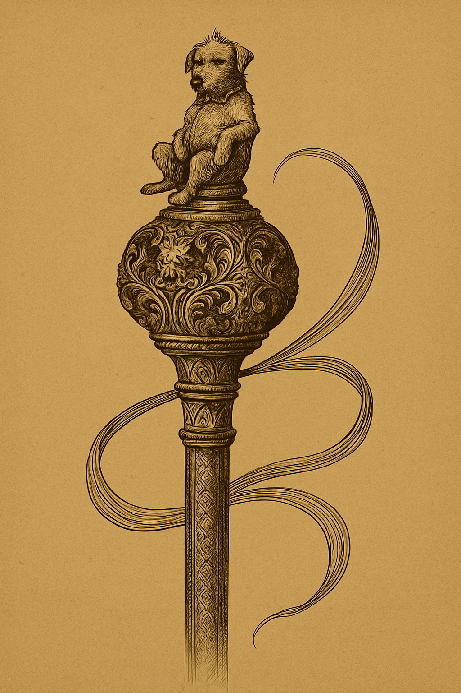

# 👑 Don Fiapo ($FIAPO)
> *The King Has Arrived. The Zoo is Closed.*



📄 **[Read the Whitepaper](WHITEPAPER.md)** | 🌐 **[Launch dApp](#)** | 💬 **[Join Community](#)**

## 📜 The Legend
While the crypto world was busy playing with dogs, frogs, and hats, a true monarch was forging his kingdom in the shadows. **Don Fiapo** is not here to fetch a ball or look cute in a meme. He is here to rule.

Enough with the inflationary puppies and utility-less amphibians. Don Fiapo brings **Real Utility**, **Complex Game Theory**, and a **Rust-based Architecture** that would make your average solidity dev cry.

---

## 💎 Why $FIAPO? (or: Why your other bags are dust)

Most memecoins have a roadmap that consists of "Vibe" and "HODL". We have a **state-of-the-art decentralized application**.

### 🛠️ Technical Superiority
- **Lunes Layer 1 Blockchain**: Running on Ink! Smart Contracts (Rust). Fast, secure, and not congested by JPEGs of rocks.
- **Oracle-Verified Payments**: Hybrid architecture bridging Solana mining fees with Lunes execution.
- **On-Chain Governance**: A true DAO where stakers decide the future, not just the devs.

### 🎮 Gamified Economy
1.  **Mining System**: Don't just buy tokens; **mine them** using NFT Pickaxes.
2.  **NFT Evolution**: Combine two NFTs to burn them and forge a higher-tier rarity. Deflationary art.
3.  **Dynamic Staking**: Real APY yields based on protocol revenue, verified on-chain.
4.  **Affiliate Empire**: Build your own court by referring subjects and earning royalties.

---

## 🏰 The Ecosystem

| Feature | Description | The "Others" |
|:---|:---|:---|
| **Mining** | Daily claims based on NFT Tier | No utility |
| **Evolution** | Burn 2x NFTs -> Get 1x Higher Tier | "Right Click Save" |
| **Governance** | Propose & Vote on-chain | "Trust me bro" |
| **Tech Stack** | Rust, Next.js 14, Railway, Docker | A Telegram Bot |

---

## 🚀 Creating Your Empire (Getting Started)

### Prerequisites
- **Node.js** v18+ (For the sophisticated frontend)
- **Rust/Cargo** (For the iron-clad contract)
- **Docker** (For the Oracle service)

### 1. Clone the Kingdom
```bash
git clone https://github.com/donfiapodelamanga-cpu/DonFiapo.git
cd DonFiapo
```

### 2. Ignite the Frontend
```bash
cd don-fiapo-web
npm install
npm run dev
```

### 3. Run the Smart Contracts Locally
```bash
cd don_fiapo

# ink! v4 requires cargo-contract 3.2.0 in this project
cargo install cargo-contract --version "=3.2.0" --force
rustup target add wasm32-unknown-unknown

# compile the contracts
cargo contract build --manifest-path contracts/core/Cargo.toml
for contract in affiliate rewards noble_affiliate oracle_multisig staking ico governance lottery airdrop marketplace nft_collections; do
  cargo contract build --manifest-path contracts/$contract/Cargo.toml
done

# start the local contracts node
substrate-contracts-node --dev
```

Then deploy from another terminal:

```bash
cd don_fiapo

# core first
cargo contract instantiate \
  --manifest-path contracts/core/Cargo.toml \
  --suri "//Alice" \
  --url ws://localhost:9944 \
  --args '"Don Fiapo"' '"FIAPO"' '1000000000000000000' \
    "5GrwvaEF5zXb26Fz9rcQpDWS57CtERHpNehXCPcNoHGKutQY" \
    "5GrwvaEF5zXb26Fz9rcQpDWS57CtERHpNehXCPcNoHGKutQY" \
    "5GrwvaEF5zXb26Fz9rcQpDWS57CtERHpNehXCPcNoHGKutQY" \
    "5GrwvaEF5zXb26Fz9rcQpDWS57CtERHpNehXCPcNoHGKutQY" \
  --execute \
  --skip-confirm
```

After deploying `fiapo-core`, deploy the dependent contracts with the core address:

```bash
# examples
cargo contract instantiate --manifest-path contracts/affiliate/Cargo.toml --suri "//Alice" --url ws://localhost:9944 --salt 616666696c696174652d303031 --args <CORE_ADDRESS> --execute --skip-confirm
cargo contract instantiate --manifest-path contracts/rewards/Cargo.toml --suri "//Alice" --url ws://localhost:9944 --salt 726577617264732d303031 --args <CORE_ADDRESS> --execute --skip-confirm
cargo contract instantiate --manifest-path contracts/noble_affiliate/Cargo.toml --suri "//Alice" --url ws://localhost:9944 --salt 6e6f626c652d303031 --args <CORE_ADDRESS> --execute --skip-confirm
cargo contract instantiate --manifest-path contracts/staking/Cargo.toml --suri "//Alice" --url ws://localhost:9944 --salt 7374616b696e672d303031 --args <CORE_ADDRESS> --execute --skip-confirm
cargo contract instantiate --manifest-path contracts/ico/Cargo.toml --suri "//Alice" --url ws://localhost:9944 --salt 69636f2d303031 --args <CORE_ADDRESS> --execute --skip-confirm
cargo contract instantiate --manifest-path contracts/governance/Cargo.toml --suri "//Alice" --url ws://localhost:9944 --salt 676f7665726e616e63652d303031 --args <CORE_ADDRESS> --execute --skip-confirm
cargo contract instantiate --manifest-path contracts/lottery/Cargo.toml --suri "//Alice" --url ws://localhost:9944 --salt 6c6f74746572792d303031 --args <CORE_ADDRESS> --execute --skip-confirm
cargo contract instantiate --manifest-path contracts/oracle_multisig/Cargo.toml --suri "//Alice" --url ws://localhost:9944 --salt 6f7261636c652d303031 --args '["5GrwvaEF5zXb26Fz9rcQpDWS57CtERHpNehXCPcNoHGKutQY","5FHneW46xGXgs5mUiveU4sbTyGBzmstUspZC92UhjJM694ty"]' '2' --execute --skip-confirm
```

Notes:

- `spin_game` is not part of the deploy flow anymore because the spin feature is offchain.
- The generated addresses can be saved in `don_fiapo/deployed_addresses.env`.
- If `DuplicateContract` appears, redeploy with a different `--salt`.

---

## 🗺️ Roadmap to Domination

### Phase 1: The Coronation ✅
- [x] Token Launch
- [x] Website
- [x] Whitepaper
- [x] Memes

### Phase 2: Kingdom Conquest 👑 (Active)
- [ ] **ICO - Mining via NFTs**: The core distribution mechanic.
- [ ] **Marketplace**: P2P trading for Royal NFTs.

### Phase 3: The Meme Empire ⚔️
- [ ] **Staking**: Earn yield on your $FIAPO.
- [ ] **Community Rewards**: Incentives for loyal subjects.
- [ ] **New NFT Collection**: Expanding the royal gallery.
- [ ] **Lunex Listing**: First strategic exchange integration.
- [ ] **Start of CEX Listings**: Expanding to centralized trading.

### Phase 4: Global Domination 🌍
- [ ] **Game Release**: "Royal Fiapo Race" & Arena.
- [ ] **Airdrop Distribution**: rewarding the early adopters.

---

## 🛡️ Disclaimer
*Don Fiapo is a memecoin with high-tech utility, but it is still a volatile asset. Don Fiapo does not care if you sell; he will just buy back your tokens at a discount. Do your own research, unlike the time you bought that coin because Elon tweeted an emoji.*

---

**© 2025 Don Fiapo Kingdom.** *Built with Rust, Iron, and Disdain for weak hands.*
